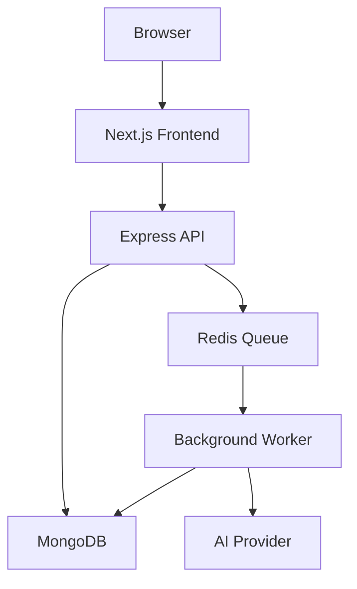
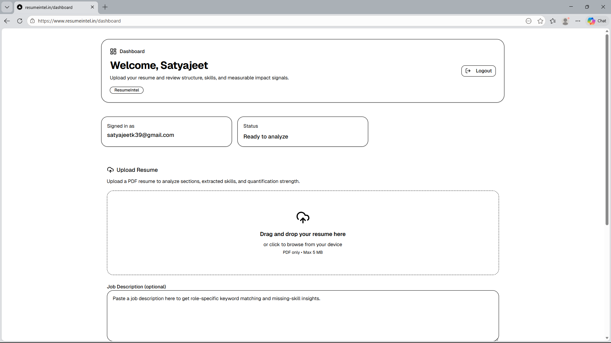
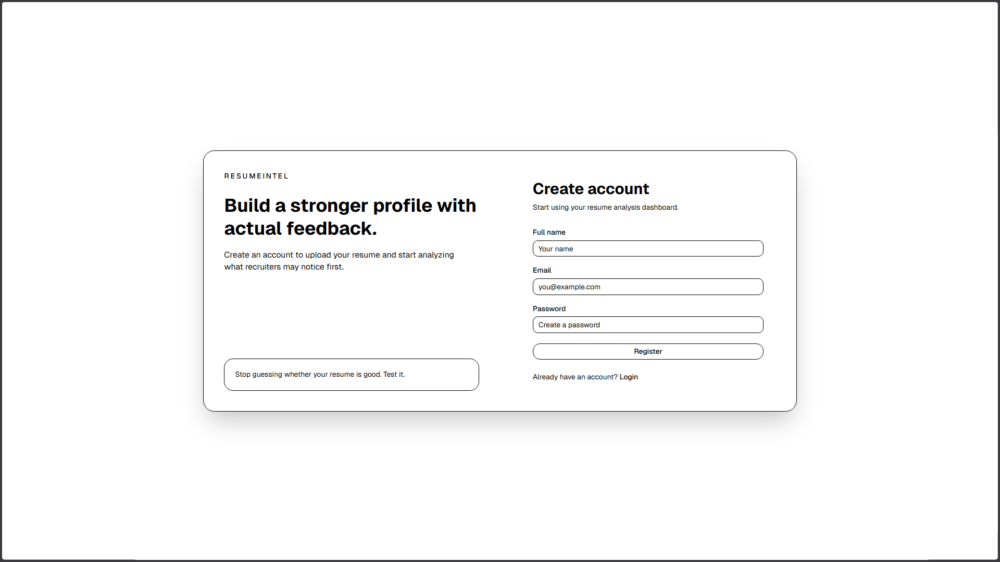
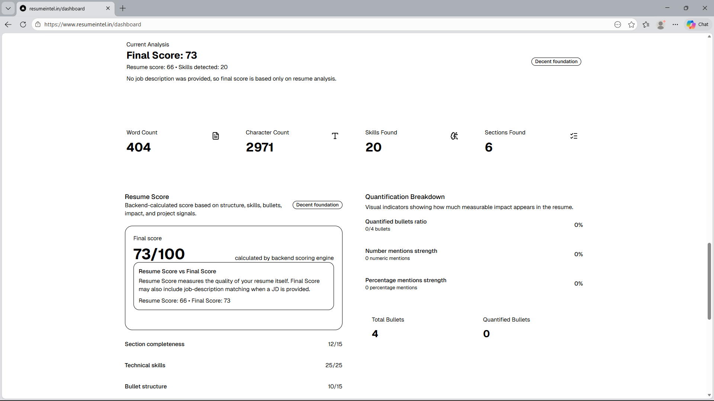
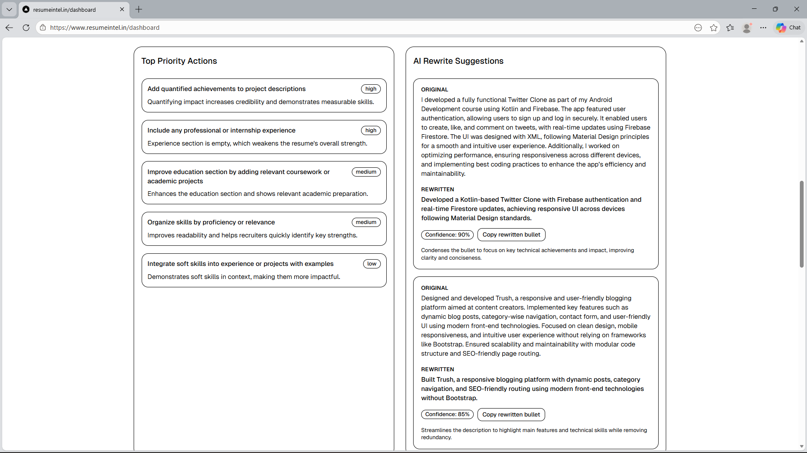

# ResumeIntel

ResumeIntel is an AI-assisted resume analysis platform that evaluates resumes across structure, quantified impact, skill coverage, and job-description alignment. It combines a `Next.js` frontend with an `Express` API, `MongoDB` persistence, and a `Redis`/`BullMQ` worker pipeline to process uploaded resumes asynchronously.

The project is designed to feel closer to a production system than a basic CRUD app: uploads are queued for background processing, users can revisit prior analyses, compare resume versions, and optionally enable AI-generated insights with usage controls.

---

## Live Demo

- **Frontend:** https://www.resumeintel.in

---

## Why this project is interesting

This project goes beyond simple file upload and scoring.

- **Asynchronous processing pipeline** using `Redis` and `BullMQ`
- **PDF resume parsing** with structured section extraction
- **Skill normalization** to reduce duplicate or inconsistent technology labels
- **Quantified impact detection** for measurable achievements
- **Job description matching** for role-specific feedback
- **Optional AI enrichment** layered on top of rule-based scoring
- **Version comparison** between current and previous completed resumes
- **Cost and usage controls** for AI-enabled analysis

---

## Core Features

### Resume Upload and Parsing
- Accepts PDF resumes
- Extracts structured sections such as skills, projects, experience, and education
- Handles parsing in the background instead of blocking the API request

### Rule-Based Resume Evaluation
Scores resumes using signals such as:
- bullet structure
- quantified impact
- action-oriented wording
- skill coverage
- overall content quality

### Job Description Matching
Users can optionally provide a job description to get:
- matched keywords
- missing keywords
- stronger role-targeted feedback

### AI-Assisted Insights
When enabled, the system augments rule-based analysis with AI-generated feedback and scoring. AI usage is gated by feature flags and daily per-user limits.

### Resume History and Comparison
Users can:
- review prior analyses
- reopen completed results
- compare a current resume against a previous completed version
- inspect score deltas and skill changes

### Queue-Based Processing
Large or more expensive analysis steps are offloaded to a worker process via `BullMQ`, improving responsiveness and making the app more production-friendly.

---

## Architecture



### Request Flow
1. The user uploads a PDF resume from the frontend.
2. The backend validates the request and creates a queued resume record.
3. The backend pushes a job to `Redis` via `BullMQ`.
4. A separate worker consumes the job and runs parsing, scoring, JD matching, and optional AI enrichment.
5. Results are stored in `MongoDB`.
6. The frontend polls for status updates and displays the completed analysis.

---

## Tech Stack

### Frontend
- `Next.js` (App Router)
- `React`
- `TypeScript`
- `Tailwind CSS`
- `shadcn/ui`

### Backend
- `Node.js`
- `Express`
- `MongoDB`
- `Mongoose`
- `Multer`

### Background Processing
- `Redis`
- `BullMQ`

### AI / Analysis
- `OpenAI` integration
- rule-based resume scoring
- PDF parsing and text analysis

### Tooling
- `Docker`
- `Docker Compose`
- `Jest`
- `GitHub Actions`

---

## Project Structure

```text
.
├── client/     # Next.js frontend
├── server/     # Express API, worker, analysis pipeline
├── docker-compose.yml
└── README.md
```

---

## Running Locally

## Option 1: Run with Docker

This is the easiest way to run the full stack locally.

### Prerequisites
- Docker
- Docker Compose
- A MongoDB connection string

### 1. Create a root `.env` file

Example:

```env
MONGO_URI=your_mongodb_connection_string
JWT_SECRET=your_jwt_secret
OPENAI_API_KEY=your_openai_api_key
OPENAI_MODEL=gpt-4.1-mini
OPENAI_TIMEOUT_MS=25000
AI_FEATURE_ENABLED=true
AI_PROVIDER=openai
AI_DAILY_LIMIT_PER_USER=3
```

### 2. Start the application

```bash
docker compose up --build
```

### Services started by Docker Compose
- `frontend` → Next.js app on `http://localhost:3000`
- `backend` → Express API on `http://localhost:5000`
- `worker` → background resume-processing worker
- `redis` → job queue broker

### Important note
`MongoDB` is **not** included in `docker-compose.yml`. The backend and worker both expect an external database via `MONGO_URI`.

---

## Option 2: Run without Docker

### Backend

```bash
cd server
npm install
npm run dev
```

### Frontend

```bash
cd client
npm install
npm run dev
```

Open:

```text
http://localhost:3000
```

---

## Environment Variables

### Shared / Backend

| Variable | Required | Description |
|---|---|---|
| `MONGO_URI` | Yes | MongoDB connection string |
| `JWT_SECRET` | Yes | Secret for authentication tokens |
| `PORT` | No | Backend port, defaults to `5000` |
| `REDIS_URL` | No | Redis connection URL |
| `AI_FEATURE_ENABLED` | No | Enables or disables AI analysis |
| `AI_DAILY_LIMIT_PER_USER` | No | Daily limit for AI-enabled analyses per user |
| `OPENAI_API_KEY` | For AI mode | API key for AI analysis |
| `OPENAI_MODEL` | No | Model used for AI analysis |
| `OPENAI_TIMEOUT_MS` | No | Timeout for AI requests |
| `AI_PROVIDER` | No | Active AI provider |

### Frontend

| Variable | Required | Description |
|---|---|---|
| `NEXT_PUBLIC_API_URL` | Yes | Public API base URL used by the frontend |

When running through Docker Compose, `NEXT_PUBLIC_API_URL` is set to `http://backend:5000` for container-to-container communication.

---

## API Overview

Main routes exposed by the backend:

### Authentication
- `POST /api/auth/register`
- `POST /api/auth/login`

### Profile
- `PUT /api/profile`

### Resume Analysis
- `POST /api/resume/upload`
- `GET /api/resume`
- `GET /api/resume/:id/status`
- `GET /api/resume/:id`
- `GET /api/resume/:id/compare/:previousId`

---

## Engineering Decisions

### Why use a worker queue?
Resume parsing and AI enrichment can be slow or variable in runtime. Instead of making the upload request wait for the full analysis to finish, the API enqueues a job and returns immediately with a processing state.

Benefits:
- better API responsiveness
- cleaner failure handling and retries
- easier scaling for expensive processing workloads
- separation of request handling from compute-heavy analysis

### Why combine rule-based scoring with AI?
Rule-based logic provides consistent baseline evaluation, while AI adds more contextual feedback and rewrite suggestions. The final system can operate with or without AI enabled.

### Why add AI limits?
AI usage has real cost and reliability implications. Daily per-user limits and a global feature switch make the system safer to operate and easier to control.

---

## Testing

The backend includes Jest-based tests for the resume analysis pipeline.

Run tests with:

```bash
cd server
npm test
```

---

## What this project demonstrates

This project is intended to showcase:
- full-stack application development
- async job processing with worker architecture
- practical AI integration with guardrails
- containerized local development
- product thinking around user feedback, history, and comparison workflows

---

## Future Improvements

Potential next steps for the project:
- richer analytics and recruiter-facing scoring breakdowns
- improved parsing for more resume layouts
- exportable reports or shareable analysis links
- end-to-end tests for core upload and polling flows
- stronger observability around queue processing and failures

---

## Screenshots

### Create Account


New users can create an account and start using the resume analysis dashboard in a simple, focused onboarding flow.

### Upload and Analysis Dashboard


Users can upload a PDF, optionally paste a job description, and choose AI or non-AI analysis mode from the main dashboard.

### Analysis Results


Completed analysis includes final score, skill detection, section coverage, and quantified impact metrics generated by the backend scoring engine.

### AI Rewrite Suggestions


AI mode generates prioritized improvements and bullet rewrite suggestions to help users make their resumes clearer and more impact-focused.

---

## License

This project is currently unlicensed. Add a license if you plan to distribute or open-source it publicly.
